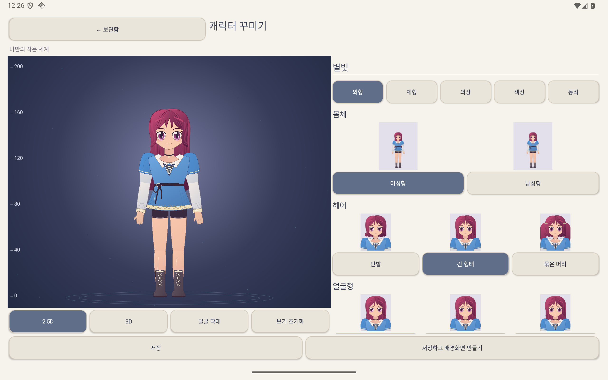
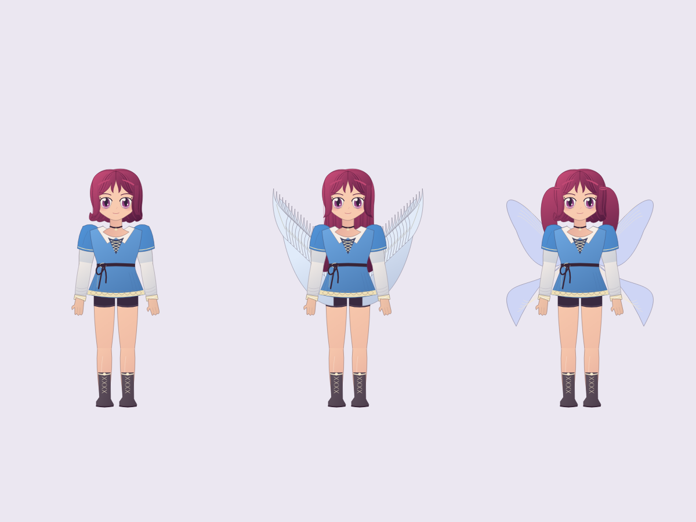
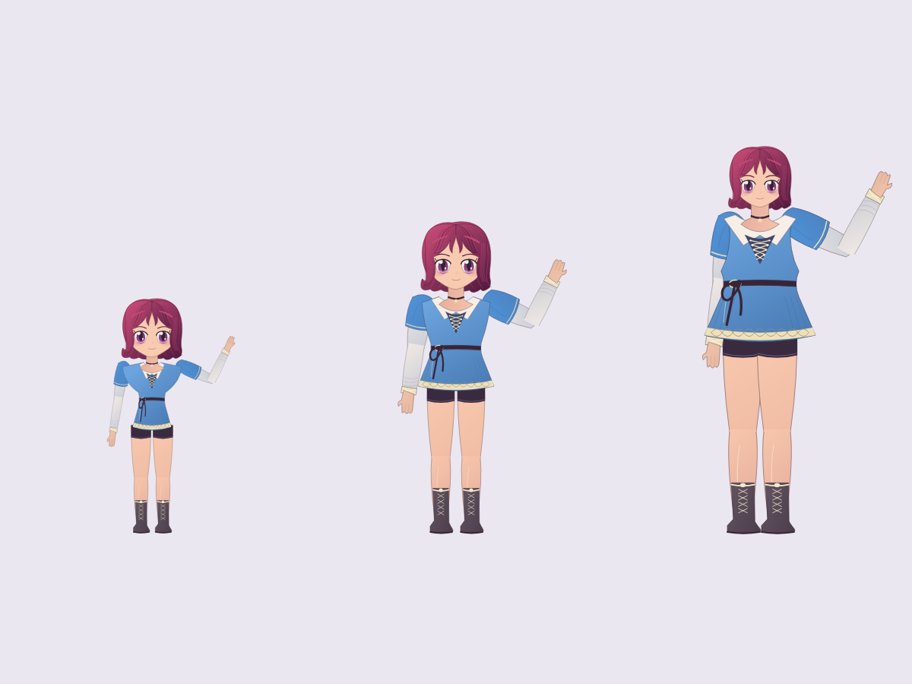

# v1.17 — 캐릭터 아틀리에

## 사용 방법

홈의 **캐릭터 만들기** → **새 캐릭터** → 외형·체형·의상·색상·동작을 선택한다. **저장하고 배경화면 만들기**로 이동하면 독립 캐릭터 레이어가 추가된다. 일반 이미지/GIF를 함께 배치할 수 있다. 실제 배경화면 적용은 기존 정적/라이브 선택과 시스템 확인을 사용한다.

- 여성형/남성형, 헤어·얼굴형·눈·눈썹·코·입 각각 3종.
- 키 120–200cm, 머리·어깨·상체·팔·다리 비율과 두께. 보기 확대는 키를 바꾸지 않는다.
- 헤일로·머리장식·몸통·장갑·신발·날개 분리. 부위별 기본색/보조색, 피부·헤어·눈동자 RGB/HEX 입력.
- 정지, 호흡/눈 깜박임, 손 흔들기. 캐릭터 PNG나 게임 모델 대신 벡터 부품을 직접 렌더링한다.
- 저장·초안 이어쓰기·복제·이름 변경·삭제. 잘못된 색상 입력을 자동 보정해 저장하지 않는다.
- 작품당 캐릭터 1개는 이미지 8개/GIF 2개 제한과 별도다. 위치·크기·회전·반전·표시·앞뒤 순서 편집.
- 적용된 배경화면은 캐릭터 보관함 수정/삭제와 독립적이다. 충전 감지·기존 마법진·1/3/5/7초 동작은 변경하지 않았다.

## 기준 이미지와의 비교

붉은 단발, 큰 자주색 눈, 작은 코/입, 끈 장식 튜닉과 부츠, 부드러운 색상 계열을 반영했다. 세 헤어는 다른 실루엣과 머릿결 경로를 가지며 얼굴·의상·장비도 별도 Path로 제작했다. 극단 체형의 어깨 틈과 손 흔들기 잘림은 실제 캡처 후 수정했다.

**동일한 게임 품질의 3D 모델은 아니다.** 정면 중심의 스타일화된 2.5D 벡터다. 이터니티 모델의 입체 얼굴, 360도 시점, 메시 변형, 머리카락/직물 물리는 포함하지 않는다. 3D 버튼은 준비 중 안내만 표시한다. 원본과의 정량적 일치율을 측정하지 않았다.

## 확인한 범위

2026-10-08 Windows 작업 트리 검증:

- `testDebugUnitTest`: 52개 통과, 실패/오류 0. 개인 미커밋 테스트를 포함한 로컬 결과이며 배포 소스의 결과는 CI 로그에서 별도 확인한다.
- `lintDebug`: 오류 0, 경고 14. `assembleDebug`, `assembleDebugAndroidTest` 성공.
- API 36 Phone/Tablet 각각 전체 `V113Instrumentation`: `V113_CHECKS_OK`.
- 저장 실패/조용한 AtomicFile commit 실패 주입, 손상 파일 보존, 초안 이름 변경, 13개 장착 변형의 색상 독립성.
- RGB 오류 상태 화면 재생성/취소, 한국어·일본어·영어에서 체형/모든 장비 슬롯 조작, 미저장 변경 분리.
- 배경화면 사본, 앞뒤 합성, 숨김, 선택 고정 제스처, 가로 화면 초기 크기, 7초 이후에도 유지되는 배경화면 미리보기.
- 태블릿에서 키보드 RGB 입력, 헤어 변경, 1.3배 글꼴 실제 조작. 글꼴 설정은 원래 값으로 복원했다.
- 브라우저 회귀: `wallpaper-browser`, `editor-gallery`, `charging-duration-browser`, `charge-info-browser` 통과.
- 독립 코드 검토 지적 4건 수정 후 재검토에서 중요 잔여 문제 없음. 코드 검토를 시각 품질/실기기 검증으로 대체하지 않았다.

Samsung 실기기는 USB 승인이 확인되지 않아 설치/테스트하지 않았다. API 23 기기 검증과 정량적 FPS/전력 측정은 수행하지 않았다. 가상 기기 결과가 Samsung 잠금화면 정책을 보장하지 않는다.

## 주요 코드

- `CharacterDefinition.kt`, `CharacterStore.kt`: 불변 설정, 초안/복구 파일, 저장 후 내용 확인.
- `CharacterGeometry.kt`, `CharacterParts.kt`, `CharacterRenderer.kt`: 관절·벡터 부품·캐시된 Paint/Path/Shader와 움직임.
- `CharacterActivity.kt`, `CharacterPreviewView.kt`: 관리/편집, 미리보기 생명주기, RGB/HEX, 회전 복원.
- `ScreenScene.kt`, `ScreenEditorView.kt`, `ScreenEditorActivity.kt`, `LayeredSceneRenderer.kt`: 캐릭터 레이어와 배경화면 전용 미리보기.
- `UploadedWallpaperStore.kt`, `WallpaperArtwork.kt`, `MediaLibrary.java`: 적용 사본과 구버전 호환. 스키마 4, 배경화면 사본 버전 2.

새 외부 런타임 라이브러리·네트워크 API·유료 생성 서비스는 추가하지 않았다. `graphify update .`는 AST만 사용했다. 일부 Kotlin 구문은 graphify 분석기가 부분 해석하므로 컴파일/테스트 결과를 기준으로 삼았다.

## 배포 구분

버전 1.17 / versionCode 20. `codex/stellar-sanctuary-v112`에서만 배포하며 main 병합은 하지 않는다. GitHub Actions는 단위 테스트·lint·debug APK를 검증한다. CI 임시 서명 APK와 기존 앱 업데이트용 로컬 서명 APK를 구분한다. 업데이트 APK는 v1.16 인증서와 비교하고 공개 다운로드를 재검증한 후 안내한다. 개인 Gradle/Studio/드로잉 변경과 서명 키는 커밋/CI에 넣지 않는다.
