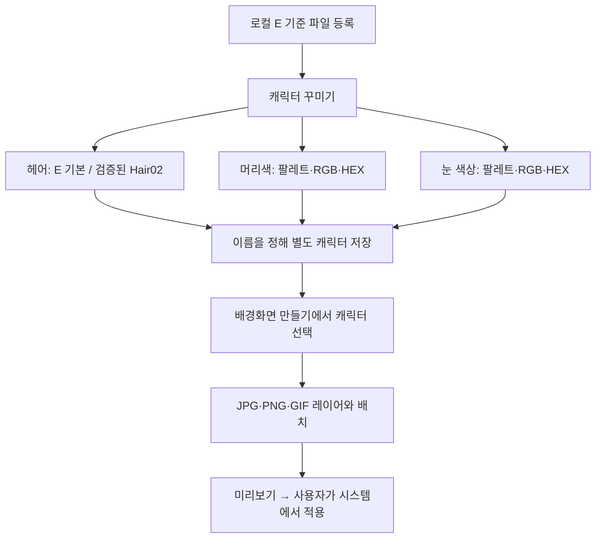

# v1.22 모바일 VRM 헤어·독립 색상·저장 Implementation Plan

> **For agentic workers:** REQUIRED SUB-SKILL: Use superpowers:executing-plans to implement this plan task-by-task. Steps use checkbox (`- [ ]`) syntax for tracking.

**Goal:** 검증된 E 캐릭터에서 두 헤어 중 하나를 선택하고 머리·홍채 색상을 따로 편집하여 새 캐릭터로 저장한 뒤, 기존 이미지 합성 배경화면에 같은 모습으로 사용한다.

**Architecture:** 원본 VRM 보관함과 편집 캐릭터를 분리한다. 이전 단계에서 실제로 조합하고 검증한 E/Hair02 결과를 헤어 선택의 준비된 모델로 사용하며, Hair02 전체 캐릭터를 대신 선택하지 않는다. 하나의 VRM만 렌더링하고 별도의 편집 설정을 공통 뷰어에 전달한다. 작품과 적용본에는 편집 설정의 사본을 고정하여 나중의 캐릭터 수정이 기존 배경을 바꾸지 않는다.

**Tech Stack:** 기존 Kotlin Views/WebView, three 0.180.0, @pixiv/three-vrm 3.5.5, Node 내장 테스트, Android AtomicFile. 새 라이브러리·서버·유료 서비스 없음.

**Spec:** `../specs/2026-10-09-character-parts-v121-design-ko.md`의 1·4·6–9절과 `2026-10-09-vrm-real-hair-assembly.md`의 「합격 이후의 모바일 통합 경계」. 실자료 결과는 `../../VRM_HAIR_PREPARATION_KO.md`.

**상태:** 구현 전 검토용 계획. 이전 로컬 헤어 조합은 완료됐지만 이 문서의 모바일 기능은 아직 구현되지 않았다. 기존 Native 실행 방식을 유지한다. 계획 확인 후 실행한다.

## Global Constraints

- “원본은 덮어쓰지 않고 별도 작업 출력만 만든다.” `.vroid`와 입력 VRM을 수정하지 않는다.
- “머리카락과 홍채의 색상은 서로 독립된 설정이다.” 각각 팔레트, RGB 0–255, `#RRGGBB`, 해당 부위 원본 복원을 제공한다.
- “초기 상태에서는 임의의 색상값을 덧칠하지 않고 원본 재질을 유지한다.” 색상 미지정은 `null`로 저장한다.
- “개인 모델을 Git, 공개 APK, Actions artifact에 포함하지 않는다.” 실제 VRM·텍스처·썸네일·검증 스크린샷은 로컬 자료다.
- “배경화면은 사용자가 다시 적용하기 전까지 기존 버전을 유지한다.” 저장과 적용은 서로 다른 동작이다.
- 기존 한국어·일본어·영어, minSdk 23, compileSdk/targetSdk 37, Java 17을 유지한다. Gradle·드로잉 등의 기존 미커밋 변경은 건드리지 않는다.
- 기존 원본 화질·메모리 예산·디코딩 직렬화·화면 비활성화 시 중지 정책을 유지한다. 메모리 부족을 숨기려고 축소하지 않는다.
- 이번 범위는 E의 검증된 헤어 2종과 독립 염색이다. 얼굴형·눈 모양·입 모양·체형·의상 파츠는 준비되지 않았으므로 작동하는 선택지로 표시하지 않는다.
- 임의 VRM끼리의 모바일 헤어 추출/결합, VRM 내보내기, 원본 모델 삭제/자동 정리 기능은 추가하지 않는다.
- 공개 배포 시 v1.22 / versionCode 25 이상으로 증가한다. 실행 시 더 최신 배포가 있으면 그보다 높인다. main 병합은 하지 않는다.

## 사용자에게 보일 흐름과 방식 선택

채택안은 **검증된 헤어 조합 결과 + 별도 편집 설정**이다. 이미 확인한 형상과 원본 텍스처를 그대로 사용하여 휴대폰에서 색상·저장 흐름을 완성한다. 두 번째 방법인 임의 모델의 실시간 헤어 추출·조립은 지원 범위와 실패 조건이 크게 늘어나므로 이번에 넣지 않는다. 준비된 조합 파일을 쓰는 제한은 화면과 결과 보고에서 숨기지 않는다.

첫 화면은 실제 캐릭터 미리보기, 헤어/머리색/눈 색상 탭, 하단 저장 버튼으로 구성한다. 세로 휴대폰은 미리보기 위·도구 아래, 넓은 태블릿은 미리보기 왼쪽·도구 오른쪽이다. 그림이나 AI 시안을 실제 렌더 결과로 대신하지 않는다.

## Review Focus

1. 빠른 헤어 연속 선택 중 늦게 도착한 이전 로드가 새 선택을 덮어쓰지 않아야 한다. Task 3의 세대 번호 검사.
2. 원본 복원과 헤어 교체가 다른 부위의 색상을 지우지 않아야 한다. Task 1–3의 독립성 검사.
3. 저장 중 앱 종료·저장 공간 부족·동시 수정은 기존 캐릭터와 적용본을 손상시키지 않아야 한다. Task 1·4의 저장 실패 검사.
4. 구버전 작품과 원본 VRM 미리보기는 편집 정보 없이도 그대로 열린다. Task 4의 이전 JSON 호환 검사.
5. 잘못된/없는 파츠·다른 파일 해시·미지원 버전은 다른 모델로 몰래 대체하지 않는다. Task 1·3의 누락/변조 검사.

---

## Task 1: 검증된 헤어 목록과 편집 캐릭터 저장

**Files:** Create `app/src/main/java/com/yj/magiccircle/VrmAvatarDefinition.kt`, `VrmAvatarStore.kt`; Create matching `app/src/test/java/com/yj/magiccircle/VrmAvatarRulesTest.kt`, `app/src/androidTest/java/com/yj/magiccircle/VrmAvatarStorageChecks.kt`. Reuse `VrmModelStore.kt`; 원본 보관함 포맷을 편집 캐릭터 포맷으로 대체하지 않는다.

**Interfaces:**
- `VrmDye(hair: String? = null, iris: String? = null)`; 저장값은 대문자 `#RRGGBB` 또는 `null`.
- `VrmAvatarAppearance(profileVersion: Int, baseModelId: String, hairId: String, modelId: String, dye: VrmDye)`; profileVersion=1, hairId=`e-original` 또는 `e-hair02`.
- `VrmAvatarDefinition(id: String, revision: Int, name: String, appearance: VrmAvatarAppearance)`; id는 UUID, 저장 revision은 1 이상, 이름은 기존 CharacterRules와 같은 1–40자 정책.
- `VrmAvatarRules.validate(definition: VrmAvatarDefinition)`, `toJson(definition: VrmAvatarDefinition): JSONObject`, `fromJson(value: JSONObject): VrmAvatarDefinition`, `modelId(hairId: String): String`, `parseHex(value: String): String`, `fromRgb(r: Int, g: Int, b: Int): String`.
- `VrmAvatarStore.get(context)`, `list(): List<VrmAvatarDefinition>`, `find(id: String): VrmAvatarDefinition?`, `save(value: VrmAvatarDefinition, expectedRevision: Int?): VrmAvatarDefinition`, `saveDraft(value: VrmAvatarDefinition)`, `draft(id: String): VrmAvatarDefinition?`.
- 새 저장은 expectedRevision=null이며 기존 ID가 있으면 거절한다. 기존 수정은 현재 revision과 일치해야 하고 저장 때 1 증가한다. 초안 revision=0은 새 캐릭터에만 허용한다.

**검증된 로컬 파일 연결:**
- E 기본 모델: `ef6513de66aee3ab78b105e53b2e72c5d92834fc2a49c542221c08ec9f0811d0`.
- 실제 E/Hair02 조합: `c1853aa3c22b5c3b58ba8f819c4b2c4e7bd318aeeefaa9739f7c9f3bb205a708`.
- Hair02 원본 전체 모델 `f4df9883…`는 헤어 슬롯의 대체 입력이 아니다. 기존 일반 VRM 가져오기는 계속 허용한다.
- 사용자는 기존 파일 선택기로 두 VRM을 가져온다. 없는 헤어는 필요한 파일 설명과 함께 비활성화한다. 파일명만으로 동일성을 판단하지 않는다.

- [ ] `hairMappingRejectsDonorWholeModel`, `colorsRemainIndependent`, `invalidHexAndVersionRejected`를 먼저 작성한다. 예: `assertEquals("#12ABEF", parseHex("#12abef"))`; `#123`, NaN, RGB -1/256, profileVersion=2를 거절한다.
- [ ] 저장 검사에 같은 모델로 두 UUID 저장 시 둘 다 유지, revision 충돌 거절, 실패한 AtomicFile 게시 후 이전 자료 유지, 저장하지 않은 초안이 목록에 노출되지 않음을 추가하고 실패를 확인한다.
- [ ] 기존 AtomicFile/동기화 패턴으로 `noBackupFilesDir/vrm-avatars` 아래 독립 저장을 구현한다. saved/drafts는 하나의 상태 파일에서 다루어 수정본 게시와 해당 초안 제거를 한 원자 저장으로 처리한다. JSON 읽기 한도 1 MiB, 최대 저장 항목 1024개. 원본 VRM 재복사·삭제·원본 선택 변경은 하지 않는다.
- [ ] 관련 단위 검사와 `checks=vrm-avatar-storage`를 실행해 통과 확인 후 이 작업 파일만 커밋한다.

## Task 2: 머리·홍채의 원본 화질 독립 염색

**Files:** Create `vrm-viewer/avatar-dye.js`, `avatar-dye.test.js`; Modify `vrm-viewer/viewer.js`, `model-memory.js`와 관련 검사(추가 자원이 있는 경우), `package.json`, generated `app/src/main/assets/vrm-preview/viewer.js`, `VrmWebView.kt`.

**Interfaces:**
- `normalizeDye(value): {hair: string|null, iris: string|null}`; Kotlin 검증과 동일한 범위를 사용한다.
- `bindAvatarDye(vrm, profile): {set(dye): void, dispose(): void}`; profile은 신뢰하는 로컬 모델 해시와 검증된 재질 매핑이다. 원격 메타데이터에서 실행 코드/매핑을 받지 않는다.
- `window.vrmPreview.appearance(value)`; 아직 로드 중이면 최신 설정만 보관하고 첫 정상 프레임 전에 적용한다. 기존 `configure(placement)`와 분리하여 염색할 때 카메라를 초기화하지 않는다.
- `VrmWebView.appearance(view: WebView, value: VrmAvatarAppearance?)`; null은 완전한 원본 경로이며 기존 VRM 기능에 영향이 없어야 한다.

- [ ] `defaultPreservesOriginalMaterials`, `hairDoesNotDyeSkinClothesOrEars`, `irisPreservesWhitePupilHighlight`, `restoreOnePartPreservesOther`, `unknownProfileFailsClosed`를 먼저 작성하고 실패를 확인한다.
- [ ] 두 실제 모델의 재질과 텍스처 영역을 다시 대조한다. 이름과 구조가 맞는 hair 재질 및 `EyeIris`만 대상으로 하며 Body 전체·눈 흰자·별도 하이라이트·귀·꼬리는 제외한다. 위치 기반 재질 번호를 다른 모델에 적용하지 않는다.
- [ ] 기존 MToon의 텍스처 샘플 뒤에 원본 명암을 유지하는 색상 치환을 적용한다. 단순 색 곱셈만으로 완료하지 않는다. 어두운 동공과 무채색 하이라이트의 보호 범위는 E 텍스처의 실제 픽셀을 확인하여 해당 프로파일에 한정한다. 출력 알파·UV·텍스처 크기는 불변이다. 원본 복원은 계산 역변환이 아니라 원본 재질 경로 복귀다.
- [ ] 설치된 3.5.5 MToon 구현/공식 문서와 대조하여 작은 공통 셰이더 연결부로 구현한다. 지원 코드 위치가 달라지면 조용히 잘못 염색하지 않고 오류를 표시한다. 매 프레임 텍스처 재생성·두 모델 동시 로드·비트맵 다운샘플링은 금지한다.
- [ ] 원본/검정/백금색/빨강/파랑을 두 헤어와 눈에 각각 적용하여 동일 구도로 캡처한다. 흰자·동공·하이라이트 훼손 또는 밝은 색 변경 실패 시 이 작업은 미완료이며 후속 UI를 완성됐다고 배포하지 않는다. 영역 분리가 불가능하면 필요한 마스크 자료를 명확히 보고한다.
- [ ] Node 검사, 번들 재생성, 반복 염색 전후 texture/bitmap 수와 원본 크기 불변을 확인한 뒤 관련 소스와 번들만 커밋한다. 개인 텍스처·캡처는 커밋하지 않는다.

## Task 3: 실제 VRM 편집 화면과 저장 목록

**Files:** Create `VrmAvatarActivity.kt`; Modify `AndroidManifest.xml`, `VrmPreviewActivity.kt`, `CharacterActivity.kt`; Create `app/src/androidTest/java/com/yj/magiccircle/VrmAvatarEditorChecks.kt`. 기존 2.5D `CharacterActivity` 편집 로직을 실제 VRM 편집인 것처럼 재사용하지 않는다.

**Interfaces:** Activity 진입 extra `avatarId`는 저장한 캐릭터 재편집, 없으면 E 기준 새 캐릭터. 앞 작업의 appearance/store를 사용한다. 진입점은 원본 VRM 화면의 `캐릭터 꾸미기`와 캐릭터 보관 화면의 `저장한 VRM 캐릭터`다.

- [ ] `draftDoesNotAlterSavedAvatar`, `latestHairSelectionWins`, `cancelRestoresSavedValues`, `rgbHexSyncAndValidation`, `rotationRestoresUnsavedDraft` UI 검사를 추가하고 실패를 확인한다. 회전/닫기 중 이전 로드 콜백이 새 View를 만지지 않음을 검사한다.
- [ ] 실제 WebView 미리보기와 헤어·머리색·눈 색상 탭을 구성한다. 헤어는 실제 렌더 썸네일 2개, 색상은 팔레트와 RGB/HEX, 부위별 원본 복원이다. 현재 색상을 바꿔도 다른 부위 값은 보존한다. 같은 UI를 전화 세로/태블릿 가로에 맞추고 한국어·일본어·영어, 48dp 터치 영역·읽기 가능한 레이블을 제공한다.
- [ ] 헤어 변경 시 이전 WebView와 리소스를 완전히 해제한 뒤 선택한 모델 하나만 연다. 로딩 세대 번호, 실패/다시 시도, 원본 화질 메모리 안내를 유지한다. 실패 중 저장/적용은 막되 초안은 보존한다.
- [ ] 하단 `새 캐릭터로 저장` 및 저장된 캐릭터의 명시적인 `수정 저장`을 연결한다. 이름 입력/저장 성공 후 목록에서 다시 열어 동일한 헤어·색상을 확인한다. 뒤로 가기 시 저장/초안 유지/취소를 구분한다.
- [ ] 두 에뮬레이터에서 UI 검사와 실제 화면을 확인한 뒤 관련 파일만 커밋한다. 임의 얼굴형·체형·의상 선택지는 만들지 않는다.

## Task 4: 이미지 합성·적용본까지 같은 캐릭터 전달

**Files:** Modify `ScreenScene.kt` (SceneData 포함), `ScreenEditorActivity.kt`, `VrmSceneView.kt`, `VrmSceneDialog.kt`, `WallpaperController.kt`, `VrmWallpaperStore.kt`, `VrmWallpaperService.kt`; extend `ScreenSceneTest.kt`, `VrmSceneChecks.kt`, `VrmWallpaperChecks.kt`.

**Interfaces:** `VrmSceneLayer` 마지막에 `avatar: VrmAvatarDefinition? = null` 추가. `modelId`는 항상 실제 VRM hash이며 avatar가 있으면 `avatar.appearance.modelId`와 같아야 한다. SceneData에는 avatar 사본 전체를 저장하고, 캐릭터 ID만 보고 최신 설정을 다시 조회하지 않는다. 모델 위치·크기·레이어 순서는 기존 VrmPlacement/beforeImage가 소유한다.

- [ ] `legacySceneHasNullAvatar`, `snapshotKeepsOldAvatarRevision`, `wrongModelAppearanceRejected`, `missingAvatarModelPreservesDraft`, `failedApplyPreservesPreviousSnapshot` 검사를 먼저 작성하고 실패를 확인한다.
- [ ] 배경 편집의 캐릭터 선택에 `저장한 VRM 캐릭터`를 추가한다. 선택한 저장본을 복사하고, 다른 캐릭터로 바꿀 때 원래 레이어 배치/이미지는 유지한다. 원본 VRM 직접 선택 시 이전 avatar 편집 정보는 반드시 지운다.
- [ ] 편집 캐릭터의 `배경화면에 사용`은 기존 작품 편집기로 이동한다. 이미지 없는 배경도 scene 경로로 적용하며, 예전 원본 VRM 단독 적용 경로에 별도의 새 외형 저장 분기를 만들지 않는다.
- [ ] VrmSceneView와 서비스 모두 같은 appearance 설정을 렌더 완료 판정 전에 전달한다. 원본 VRM은 null 경로로 그대로 렌더한다. 아직 있는 WebView를 중복 생성하지 않는다.
- [ ] WallpaperStore 새 스냅샷 version=3을 추가하고 version 1/2 읽기는 보존한다. version=3은 scene의 불변 avatar 사본을 저장하며 참조 hash/프로파일을 검증한다. 새 적용은 기존 3개 슬롯·pending·generation 안전장치를 재사용한다. 이번 단계에서 모델 삭제/GC는 하지 않는다.
- [ ] 이미지+편집 캐릭터 저장 → 앱 재시작 → 작품 재열기 → 미리보기의 헤어/색상 일치를 검사한다. 캐릭터 목록에서 후속 수정해도 기존 작품과 기존 배경화면 스냅샷은 그대로이며, 사용자가 작품에서 재선택·재적용할 때만 갱신되는지 확인한다.
- [ ] 테스트 전 에뮬레이터의 기존 home/lock/pending 상태를 기록한다. 기존 개인 적용본을 덮어쓰는 시스템 적용 조작은 추가 확인 없이 하지 않는다. 비파괴적인 snapshot/service 테스트와 별도 미리보기로 경로를 검증하고, 실제 시스템 적용 확인이 남으면 최종 보고에 분리한다.
- [ ] 관련 검사 통과 후 이 작업 파일만 커밋한다.

## Task 5: v1.22 전체 검증·배포

**Files:** Modify `app/build.gradle.kts`, 필요할 때만 `../.github/workflows/android-debug.yml`; Create `docs/V1_22_KO.md`; 기존 releases 위치에 검증한 새 APK와 sha256. 개인 VRM/썸네일/캡처는 제외한다.

- [ ] 전체 `npm test`, `npm run build`, `gradlew.bat --offline testDebugUnitTest lintDebug assembleDebug assembleDebugAndroidTest` 실행. 새 검사들을 `V113Instrumentation.kt`에 등록해 실제 성공 결과를 요구한다. 실패한 lint나 렌더를 문서로 대신하지 않는다.
- [ ] 확인한 API 36 전화·태블릿 serial만 사용해 기존 버전 위 업데이트, 두 헤어 교환, 색상 독립/원본 복원, 새 이름 두 개 저장, 재편집/앱 재시작, 이미지 합성, 화면 회전·숨김/복귀, 빠른 반복 교환을 실행한다. 모델만 불러오는 기존 테스트 결과를 이번 기능 검사로 보고하지 않는다.
- [ ] 원본 파일 hash, 기존 작품·적용본·일반 VRM 불러오기 보존을 확인한다. 오류 로그와 원본 해상도/리소스 해제 카운터를 기록한다. 실제 삼성 하드웨어와 OS 최대 RAM은 검사하지 않았다면 별도로 남긴다.
- [ ] `graphify update .`를 AST-only로 실행하고 별도 읽기 전용 에이전트로 변경 전체를 검토한다. 생성 그래프/관련 없는 WIP/개인 자산을 무심코 stage하지 않는다.
- [ ] 현재 브랜치에 관련 변경만 커밋/게시한다. 공개 저장소·무료 실행 조건과 서명 호환성을 확인하고, 과금 가능성이 생기면 실행 전에 한국어로 승인 요청한다. main 병합은 하지 않는다.
- [ ] GitHub Actions 성공과 artifact 내용/버전/서명을 확인한다. GitHub Release에 호환 로컬 서명 APK를 게시한 뒤 모바일 직접 다운로드 응답과 SHA-256을 검증한다. artifact의 CI 서명과 로컬 업데이트 APK 서명이 다르면 구분한다. 비공개 모델을 공개 APK에 포함하지 않았음을 ZIP 목록으로 검사한다.
- [ ] 최종 보고에 모바일 APK 직접 링크, 구현/미구현 구분, 실제 편집 화면, 필요한 로컬 모델 등록 절차를 제공한다. 링크가 실제로 확인되지 않으면 배포 완료라고 쓰지 않는다.

## 계획 자체 검토

- 기존 사양의 헤어 선행·독립 염색·별도 캐릭터 ID·불변 작품/배경·개인 자산 보호는 Task 1–5에 대응한다.
- 얼굴형/눈 모양/입 모양/체형/의상과 임의 VRM 조합은 최종 목표에서 삭제하지 않고 다음 자산 단계로 남긴다.
- 실패 조건 다섯 개는 각 작업의 검사에 배정했다. 추가 모델의 이름만 같다고 지원하지 않는다.
- 색상 처리의 실제 화질 합격은 Task 2의 조건이다. 아직 보지 않은 염색 화면을 성공 예시나 완성품으로 표시하지 않는다.
- 기존 파일에 SceneData가 포함돼 있음을 확인했다. 존재하지 않는 `SceneData.kt`를 별도로 만드는 리팩터링은 하지 않는다.
- 기존 Native 실행을 유지하고 최종 독립 검토를 수행한다. 이 계획의 사용자 확인 전에는 제품 코드·앱 버전·기기 배경을 바꾸지 않는다.
