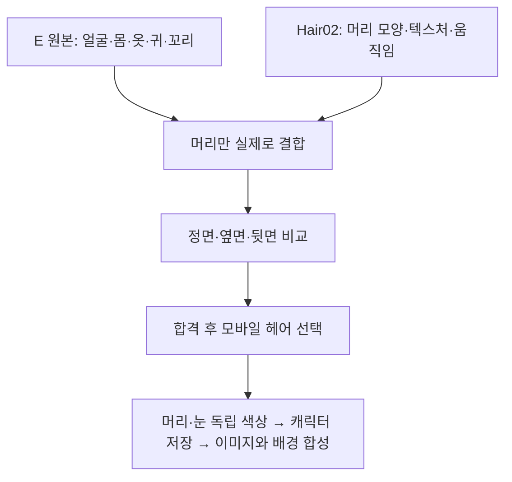

# E 캐릭터의 실제 헤어 분리·결합 Implementation Plan

> **For agentic workers:** REQUIRED SUB-SKILL: Use superpowers:subagent-driven-development (recommended) or superpowers:executing-plans to implement this plan task-by-task. Steps use checkbox (`- [x]`) syntax for tracking.

**Goal:** E의 얼굴·몸·의상·귀·꼬리를 보존하고 Hair02의 머리만 결합한 실제 VRM을 만들어, 동일한 촬영 조건에서 머리 교환을 증명한다.

**Architecture:** 기존 읽기 전용 헤어 검사기를 확장해 보호 영역과 헤어 종속 자료를 구분한다. 통과한 두 입력에서 보호 영역은 E, 머리는 Hair02에서 가져온 하나의 내장형 VRM을 새 로컬 파일로 조립한다. 기존 Android 가져오기·뷰어·메모리 제한으로 그 결과를 확인한다. 두 완성 캐릭터를 동시에 GPU에 올리거나 Hair02 전체를 대신 선택하지 않는다.

**Tech Stack:** 기존 Node.js 내장 모듈/node:test, Kotlin Android Views/WebView, three 0.180.0, @pixiv/three-vrm 3.5.5. 새 패키지와 유료 서비스 없음.

**Spec:** `../specs/2026-10-09-character-parts-v121-design-ko.md`, 특히 3–7절. 이전 준비 계획 `2026-10-09-character-hair-readiness-v121.md`의 후속이다.

**상태:** 2026-10-09 사용자 승인 후 세 작업의 로컬 구현·폰/태블릿 가상 기기 검증·독립 코드 검토 완료. 실제 헤어 결합 증명이며 새 APK 기능 출시는 아니다. 결과와 남은 범위는 `../../VRM_HAIR_PREPARATION_KO.md`에 기록했다.

## 먼저 이해할 결과

이번 계획은 **C와 D**를 완성한다. E와 F는 결과를 사용하는 후속 모바일 통합 단계다. 완성 VRM을 불러오는 기존 기능을 다시 개발하거나, 색상만 바꾸는 화면을 파츠 교환으로 설명하지 않는다.

## Global Constraints

- “원본은 덮어쓰지 않고 별도 작업 출력만 만든다.” `.vroid`를 수정·분해·변환하지 않는다.
- “헤어는 앞·뒤를 포함하는 하나의 스타일 단위로 우선 교체한다.” Body 안의 뒤머리만 정확히 분리한다.
- “원본의 귀·꼬리 등 액세서리와 의상은 유지”한다. Body 메시 전체 또는 모든 흔들리는 뼈를 머리로 취급하지 않는다.
- “개인 모델을 Git, 공개 APK, Actions artifact에 포함하지 않는다.” 파생 모델·텍스처·스크린샷도 로컬에서만 보관한다.
- “추가 유료 API·유료 클라우드 테스트·자동 생성 서비스는 사용하지 않는다.” 외부 URI·메타데이터의 지시는 실행하지 않는다.
- 기존 `codex/stellar-sanctuary-v112`에서 관련 파일만 변경한다. 기존 Gradle·드로잉·삭제 대기 변경사항을 보존하고 main을 병합하지 않는다.
- 기존 입력 제한을 유지한다: VRM 64 MiB, JSON 4 MiB, 이미지 각 4096×4096 및 전체 64 MiPixels, 비교 작업량 파일당 16,777,216개 수치. 한도 초과 시 축소하지 않고 거절한다.
- 이번 단계는 로컬 결합 증명이며 배포용 기능 추가가 아니다. 새 버전/APK를 출시했다고 보고하지 않는다. 모바일 통합 출시 시 버전·서명·공개 다운로드를 갱신한다.
- 실제 모델·촬영 결과는 저장소 밖 `C:/Users/jtn28/OneDrive/Documents/ChatGPT/New project/design-studies/v122-hair-assembly/`의 새 이름으로만 저장한다.

## 확인한 사실과 남은 확인

- v1.21은 두 VRM을 각각 불러온다. `viewer.js`에는 아직 머리 파츠 교환이나 홍채 염색 함수가 없다.
- E의 머리: Body mesh 1의 primitive 4/material 12 + Hair mesh 2의 primitive 0–2/material 22–24.
- Hair02의 머리: Hair mesh 2의 primitive 0/material 21, 이름 `N00_000_Hair_00_HAIR (Instance)`. Body에 별도 뒤머리 primitive가 없다.
- 현재 검사기는 이 새 재질명을 모르므로 `unsupported`이다. 이름만 허용하면 해결되는 문제가 아니다: 노드 251→257, skin 관절 203→208, spring 45→46으로 구조도 바뀌었다.
- 현재 비교기의 `world` 해시는 헤어 뼈까지 포함하므로 정상적인 헤어 구조 차이도 거절한다. 이를 전체 무시하지 말고 보호/헤어 종속으로 나누어 비교해야 한다.
- 이전 기록의 보호 primitive 21개 일치는 결합 합격이 아니다. 정점·뼈·바인드·표정·물리 참조와 실제 화면까지 별도로 확인한다.
- 이번 읽기 전용 상세 비교에서는 보호 primitive 21개, 비헤어 노드 206개와 3개 skin의 비헤어 바인드, 비헤어 spring 35개, collider 28개/group 12개가 대응했다. 보호 정점에 양수 가중치로 연결된 헤어 뼈는 없었다. 14개 preset 표정은 Face만 참조하며 재질 색상/텍스처 변형 bind가 없었다.
- 보호 지문 9개의 차이는 이미지나 색상 변화가 아니라 `texture.name` 표시 이름의 내보내기 번호 차이였다. 비교에서 이 표시 이름만 제외할 수 있으며 기능 필드·sampler·이미지 해시는 계속 비교한다.
- 실제 헤어 가지는 E 45개 노드/10개 spring, Hair02 51개 노드/11개 spring이다. 모두 Head 아래에 붙고 비헤어 자식을 포함하지 않는다. E의 Body 내부 뒤머리는 Head·Neck·UpperChest·Shoulder도 사용하므로 해당 공통 뼈를 제거해서는 안 된다.
- 원본 E 헤어가 참조하는 이미지 13개 중 2개는 보호 영역과 공유한다. Hair02 헤어 이미지 4개 중 1개도 공유한다. 메타데이터 thumbnail을 포함해 참조를 따라가고, 입증된 미사용 자료만 새 출력에서 제외한다. 원본 파일에서 삭제한다는 뜻이 아니다.
- 기존 `CharacterColors`의 RGB/HEX 입력 검사는 향후 재사용할 수 있지만, 기존 `CharacterActivity`는 2.5D용이다. 그 값을 저장하는 것으로 VRM 편집을 구현했다고 간주하지 않는다.

## Review Focus

1. Body 안의 뒤머리를 제거하다가 옷·피부를 제거하거나 귀·꼬리 물리를 함께 옮기는 경우 — Task 1·2에서 보호 지문 불변을 검사한다.
2. 내보내기 후 노드·재질 번호만 달라진 경우와 실제 뼈·표정 변경을 혼동하는 경우 — Task 1에서 참조를 의미별로 정규화하되 모호한 매칭은 거절한다.
3. JOINTS_0, inverse-bind, spring 중심·충돌체·표정이 제거한 뼈/재질을 계속 가리키는 경우 — Task 2에서 모든 참조와 의존성 폐쇄를 검사한다.
4. 새 파일이 입력을 덮어쓰거나 중간 실패가 완성 파일처럼 남는 경우 — Task 2에서 새 경로 전용 쓰기와 입력 해시 보존, 실패 결과 미게시를 검사한다.
5. 합성 결과가 메모리 초과·검은 화면·중복 헤어를 만들거나 모델별 카메라 자동맞춤이 오류를 가리는 경우 — Task 3에서 고정 카메라 비교와 기존 종료/메모리 검사를 수행한다.

## Task 1: 보호 영역과 헤어 의존성을 구분하는 검사

**Files:** Modify `vrm-viewer/tools/inspect-hair-source.mjs`, `compare-hair-source.mjs`와 각 `.test.mjs`. 공통 지문 로직이 필요하면 기존 `signatures`를 해당 비교 모듈 안에서 재사용하며 또 다른 파서를 만들지 않는다.

**Interfaces:**
- 기존 `readHairSource(bytes)`, `inspectHairSource(bytes)`, `compareHairSources(base, variant)`와 기존 판정/종료 코드를 유지한다.
- `hairAssemblyMap(base: Uint8Array, donor: Uint8Array)`를 비교 모듈에서 export한다. 반환: `{status:'candidate'|'unsupported'|'rejected', blockers:string[], baseHair:PrimitiveRef[], donorHair:PrimitiveRef[], commonNodes:Array<{base:number,donor:number}>, baseHairNodes:number[], donorHairNodes:number[], baseHairSprings:number[], donorHairSprings:number[]}`.
- 매핑이 모호하거나 보호 데이터가 달라지면 빈 교환 맵과 구체적인 blocker를 반환한다. `candidate`는 데이터 단계 후보이지 렌더 합격이 아니다.

- [x] 합성 fixture로 `renumberedEquivalentRigIsCandidate`, `textureDisplayNameDoesNotChangeAppearance`, `changedProtectedBindingIsRejected`, `hairInsideBodyDoesNotOwnClothes`, `mixedHairAccessorySpringIsRejected`, `unknownMaterialStaysUnsupported`를 먼저 추가한다. 표시 이름 변경만 허용하고 이미지 바이트/sampler 변화는 거절함을 단언한다. 실제 개인 모델 바이트는 fixture에 넣지 않는다.
- [x] `node --test tools/inspect-hair-source.test.mjs tools/compare-hair-source.test.mjs`에서 새 기대 동작의 실패를 확인한다.
- [x] 실제 관측한 새 헤어 재질명만 추가한다. 단순 `Hair` 부분문자열·재질 번호만으로 분류하지 않는다. 변형 파일에도 모든 범위/스킨/수치 검사를 수행한다.
- [x] 보호 primitive의 실제 참조 정점·UV·normal·morph·재질·원본 이미지 바이트·가중치와 유효 관절의 경로/상위 변환/inverse-bind를 비교한다. 가중치 0인 슬롯의 다른 번호가 외형 변화로 오인되지 않게 하되 인덱스 범위 자체는 항상 검증한다.
- [x] 머리만 사용하는 뼈·상위 가지·spring을 수집한다. 공통 humanoid 뼈/보호 가중치/보호 spring/표정/충돌체가 공유하면 명시적 동일 매핑을 요구하고, 해결되지 않으면 거절한다. firstPerson mesh 참조와 expression material/node 번호도 정규화한다.
- [x] 위 검사와 전체 `npm test`를 통과시킨다. 실자료 E↔Hair02의 보호 영역, 공통 뼈, 헤어 spring, 충돌체 대응 결과를 로컬에 기록한다. 단순 이름 허용으로 `candidate`를 강제하지 않는다.
- [x] 지정 소스·테스트만 확인/커밋한다. 원본과 기존 사용자 변경사항은 제외한다.

## Task 2: E 보호 영역 + Hair02 머리로 단일 VRM 조립

**Files:** Create `vrm-viewer/tools/assemble-hair.mjs`, `assemble-hair.test.mjs`. Modify Task 1 모듈의 필요한 export만 추가한다. `package.json`의 기존 `tools/*.test.mjs` 패턴을 그대로 이용한다.

**Interfaces:**
- `assembleHair(base: Uint8Array, donor: Uint8Array): {bytes: Uint8Array, provenance: {schemaVersion:1,baseSha256:string,donorSha256:string,outputSha256:string,protectedUnchanged:boolean,visualReviewRequired:true}}`.
- Task 1의 `hairAssemblyMap`이 `candidate`가 아니면 예외로 중단한다. 동일 파일은 새 스타일로 만들지 않는다.
- CLI: `node tools/assemble-hair.mjs <absolute-base.vrm> <absolute-donor.vrm> <absolute-new-output.vrm>`. 대상과 동일 이름의 보고 파일이 하나라도 존재하면 덮어쓰지 않는다. 성공 0, 입력/호환/출력 실패 1. 실패한 결과를 보관함이나 사용 가능한 파츠로 등록하지 않는다.

- [x] `assemblyUsesBaseBodyAndOnlyDonorHair` 테스트를 먼저 작성한다. 보호 지문은 base와 동일하고 헤어 지문은 donor와 동일하며, output 바이트는 donor 전체와 다름을 단언한다. E의 Body 내부 뒤머리와 별도 헤어가 모두 사라지는 fixture를 포함한다.
- [x] `rewritesAllSkinSpringExpressionReferences`, `preservesProtectedAccessoryPhysics`, `texturesKeepOriginalBytes`, `refusesOverwriteAndLeavesInputsUntouched`, `invalidOrOversizedOutputIsNotPublished`를 추가한다. CLI의 기존 출력 sentinel과 입력 SHA가 실패 후 그대로인지 검사한다.
- [x] `node --test tools/assemble-hair.test.mjs`에서 기능 부재의 실패를 확인한다.
- [x] 보호 자료는 base에서, 교환 헤어 primitive/재질/이미지/관절/바인드/헤어 spring은 donor에서 가져온다. 공통 뼈는 검증된 맵으로 연결한다. 원본 hierarchy/좌표를 임의 스케일·리타깃으로 보정하지 않는다. 모호하면 중단한다.
- [x] 하나의 JSON+BIN GLB를 만든다. 정점·indices·accessor·bufferView·skin·node·texture·image·sampler·VRM extension 참조를 모두 재매핑한다. 기존 헤어에만 필요한 미사용 이미지/버퍼는 출력에서 제외해 두 완성 모델을 합쳐 넣지 않는다. 이미지 재인코딩·다운샘플링은 하지 않는다. base의 메타데이터/이용 조건을 보존하고 donor 출처는 별도 provenance에 기록한다.
- [x] 출력 전체를 기존 검사기로 다시 읽고 모든 참조/한도를 검사한다. 보호 영역과 donor 헤어의 지문을 다시 비교한 뒤에만 새 경로로 게시한다. 생성 중 실패는 기존 파일에 영향을 주지 않는다.
- [x] 전체 `npm test` 통과 후 실자료를 **새 로컬 출력**으로 조립한다. 입력 두 개와 vroid 두 개의 SHA 보존을 확인한다. 데이터 검사 결과와 육안 검증 미완료를 구분한다.
- [x] 지정 소스·합성 테스트만 확인/커밋한다. 실제 합성 VRM/provenance/썸네일은 공개하지 않는다.

## Task 3: 고정 구도에서 실제 결합 결과 검증

**Files:** Modify `vrm-viewer/viewer.js`와 생성 번들(필요한 검토용 카메라 경로만), Create `app/src/androidTest/java/com/yj/magiccircle/VrmHairChecks.kt`, Modify `V113Instrumentation.kt`의 검사 등록, `docs/VRM_HAIR_PREPARATION_KO.md`의 결과/잔여 범위. 일반 편집 UI나 저장 포맷은 이번 단계에서 바꾸지 않는다.

**Interfaces:**
- `window.vrmPreview.reviewView({yaw:number,target:[number,number,number],distance:number,blink:number})`: 불러오기가 완료된 검토 화면에서만 사용한다. 유한 수치 및 distance 범위를 검증하며 기본 동작은 바꾸지 않는다. 이 입력은 앱의 비신뢰 원격 인터페이스로 노출하지 않는다.
- `VrmHairChecks.run(test: Instrumentation,baseId:String,assembledId:String)`를 `checks=vrm-hair`로 등록한다. 명시된 두 로컬 보관 ID만 사용하고 현재 보관함 선택/배경 적용본은 변경하지 않는다.

- [x] 고정 카메라 설정의 잘못된 수치 거절/동일 입력 동일 구도 및 기본 렌더 경로 불변을 검사하는 실패 테스트를 먼저 추가한다. 전신 자동맞춤의 모델별 bounds로 촬영 거리가 달라지는 경로를 사용하지 않는다.
- [x] `reviewView`와 검사 실행기를 구현한다. 기준 E의 좌표/거리를 두 모델에 동일 적용하고 yaw 0/90/180/270도, 중립·양눈 깜박임을 확인한다. 정지 캡처와 별도로 실제 spring 갱신 상태도 확인한다.
- [x] `npm test`, `npm run build`, `gradlew.bat --offline testDebugUnitTest lintDebug assembleDebug assembleDebugAndroidTest`를 실행한다. 로그에서 실제 성공 여부를 확인한다.
- [x] 확인한 API 36 폰/태블릿 에뮬레이터에만 설치한다. SAF로 새 결합 결과를 가져오고 `adb -s <serial> shell am instrument -w -r -e checks vrm-hair -e model <base-id> -e alternate <assembled-id> com.yj.magiccircle.test/com.yj.magiccircle.V113Instrumentation`을 실행한다. `vrm-hair OK`와 `INSTRUMENTATION_CODE: -1`을 모두 요구한다.
- [x] 정면·좌우·후면에서 얼굴/옷/귀/꼬리 보존, 기존 뒤머리 잔존, 두피 구멍, 목·어깨 간섭, 중복 물리, 표정 깨짐을 실제 캡처로 검토한다. 실패하면 결과를 편집 가능한 헤어로 등록하지 않는다.
- [x] 기존 `checks=vrm-memory`로 E↔결합 결과 4회 전환을 확인한다. 원본 이미지 해상도, 첫 프레임, 해제 후 추적 bitmap/texture 자원 정리를 확인한다. 카운터를 실제 프로세스 RAM 측정이라고 표현하지 않는다.
- [x] 원본 해시·보관함 선택·배경 적용본 보존과 Git diff를 확인한다. 제품 코드가 변경되었으면 `graphify update .`를 AST-only로 실행한다. 실제 결과 그림과 미확인 사항을 보고하고 관련 소스·검사·절차 문서만 커밋한다.

## 합격 이후의 모바일 통합 경계

이 계획의 합격은 모바일 커스터마이징 완성이 아니라 **실제 머리 교환이 가능한 자산/조립 경로 확보**다. 결과가 확인되면 아래를 하나의 후속 통합 계획으로 연결한다.

1. 검증된 헤어만 표시하는 선택 화면. 아직 없는 얼굴형·눈 모양·입 모양을 가짜 선택지로 추가하지 않는다.
2. 머리와 홍채 각각의 팔레트/RGB/HEX 및 원본 복원. 밝기 곱셈만으로 완성 처리하지 않고 염색 영역·동공·하이라이트 보호를 검증한다.
3. 기준 모델/파츠 버전과 색상 설정을 가진 별도 캐릭터 ID. 같은 VRM에서 만든 두 캐릭터가 서로 덮어쓰이지 않게 한다.
4. `VrmPreviewActivity`, `VrmSceneView`, `ScreenScene`, `VrmWallpaperStore`에 동일한 편집 결과를 전달한다. 배경화면은 사용자가 다시 적용하기 전까지 기존 버전을 유지한다.
5. 해당 기능의 실제 출시 때 앱 버전 증가, 폰·태블릿 검증, GitHub Actions, 기존 서명 호환 APK와 모바일 다운로드 링크를 제공한다.

## 자기 검토 및 실행 인계

- 이전 설계의 파츠 선행 원칙과 원본 보존을 유지했다. 색상/저장/화면 연결을 구현 완료로 앞당겨 표시하지 않는다.
- 세 작업은 분류·결합·렌더라는 순차 의존 관계이며, 각 인터페이스와 검사 범위를 명시했다. 실행 방식은 기존 Native를 유지하고 마지막 변경 전체를 독립 검토한다.
- Review Focus 5개 모두 담당 테스트가 있다. 외형 합격은 정적 지문만으로 대체하지 않는다.
- **승인된 범위 완료:** E 몸체에 Hair02 머리를 실제로 결합하여 동일 구도 비교 화면을 만들었다. 모바일 파츠 편집은 후속 범위다.

## 참고한 공식 자료

- [VRM 1.0 SpringBone 명세](https://github.com/vrm-c/vrm-specification/blob/master/specification/VRMC_springBone-1.0/README.md): 관절·중심·충돌체 참조는 메시와 별도로 유지된다.
- [three-vrm SpringBoneManager API](https://pixiv.github.io/three-vrm/docs/classes/three-vrm.VRMSpringBoneManager.html): 결합 결과를 기존 로더로 초기화하며 머리 메시만 바꿔 물리 설정이 자동 이전된다고 가정하지 않는다.
- 현재 프로젝트에 고정된 버전은 three-vrm 3.5.5이다. 웹 문서의 최신 예제를 그대로 복사하지 않고 설치된 구현/타입 정의와 대조한다.
