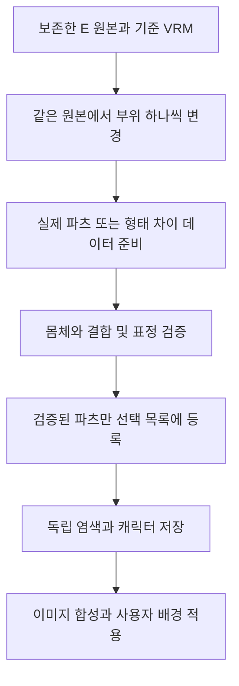

# v1.21 캐릭터 교체 파츠 선행 준비 설계

작성일: 2026-10-09. 기준 앱: v1.20, 커밋 `b5965ec`.
상태: 사용자 방향 승인 후 준비 검사 도구 구현 진행. 원본과 기준 VRM의 파일 구조를 확인했으며, 새 파츠 제작이나 모바일 편집 기능 구현이 완료된 상태는 아니다. 실행 결과와 입력 제약은 `../../VRM_HAIR_PREPARATION_KO.md` 참고.

## 1. 목표와 이번 결정

사용자는 모바일에서 머리·얼굴·눈·입과 체형을 바꾸어 캐릭터를 만들고, 부위별 색상을 따로 지정하고, 저장한 캐릭터를 이미지와 합성하여 배경화면에 사용하려 한다. 마비노기 이터니티 참고 화면의 부위 탭·모양 썸네일·팔레트 구성을 참고한다. 게임의 모델이나 이미지 자산을 추출하여 쓰지는 않는다.

사용자가 선택한 순서는 **실제로 교체할 파츠를 먼저 준비하고 검증한 뒤 편집 화면에 연결하는 것**이다. 색상만 바뀌는 기능을 완성된 캐릭터 제작기로 설명하거나, 아직 없는 파츠를 사용 가능한 항목으로 표시하지 않는다.

이번 설계는 첫 번째 호환 파츠 세트의 제작·검증에 집중한다. 성공한 자산을 사용하는 모바일 편집·저장·배경화면 연결은 다음 구현 단계로 넘긴다. 체형의 연속 조절, 의상별 염색, 추가 몸체 유형은 최종 목표에서 유지하되, 검증되지 않은 기능을 첫 세트의 성과로 포함하지 않는다.

## 2. 확보한 기준 자료

사용자가 지정한 로컬 `vRoid` 폴더의 다음 두 파일을 기준으로 한다. 원본은 덮어쓰지 않고 별도 작업 출력만 만든다.

| 자료 | 확인 내용 | 용도 |
| --- | --- | --- |
| `AvatarSample_E.vroid` | 7,225,322 bytes. ZIP 내부에 `meta.json`, `v1model/data.bin`, 모델 메타데이터, 원본 썸네일이 존재. VRoid 2.14.0 저장 정보 | 공식 VRoid 편집 원본 |
| `AvatarSample_E.vrm` | 22,349,452 bytes. VRoid 2.14.0에서 출력된 VRM 1.0, 모델 이름 `AvatarSample_E` | 모바일 출력과 파츠 비교 기준 |

원본 SHA-256: `cf80289a1dfc6e5427953b50406d61ae7386e7b5eec6be201f3945b839d4a547`.
VRM SHA-256: `ef6513de66aee3ab78b105e53b2e72c5d92834fc2a49c542221c08ec9f0811d0`.

이 둘은 사용자가 같은 캐릭터의 원본과 출력물로 제공했다. 파일 형식·이름·생성 도구의 일치까지 확인했으며, 파일 구조 검사만으로 외형이 완전히 같거나 모바일에서 정상 렌더링된다고 단정하지 않는다.

기준 VRM에는 재질 25개, 휴머노이드 뼈 54개, skin의 뼈 203개, 헤어 등을 위한 spring 45개가 있다. Face에는 표정 관련 변형 57개가 있지만 Body와 Hair에는 변형 데이터가 없다.

현재 색상 후보는 홍채 재질 1, 뒤머리 재질 12, 나머지 머리 재질 22·23·24다. 뒤머리는 Body 메시 안에 있으므로 Body 전체를 염색하면 안 된다. 이 번호는 위 해시의 모델에만 유효하며 다른 VRM에 그대로 적용하지 않는다.

기존 `test.vrm`, `AvatarSample_Y.vrm`은 비교 후보로만 사용한다. 세 모델의 Face 정점 수 4,709개와 정점 인덱스 배열, 표정 이름·순서는 같지만 뼈 위치와 헤어 뼈 경로는 다르다. 얼굴 구조의 부분적인 일치가 파츠 결합의 호환성을 증명하지는 않는다. 확장자만 바뀐 `test.vroid`는 편집 원본 후보에서 제외하되 삭제하지 않는다.

## 3. 파츠를 준비하는 방식

채택 방식은 같은 E 원본에서 변형을 만드는 것이다. 서로 다른 완성 VRM의 머리를 그대로 붙이는 방식은 몸체 비율·뼈·물리 설정이 다르므로 기본 경로로 삼지 않는다. 캐릭터 전체를 바꾸는 기능을 파츠 교환으로 이름만 바꾸지도 않는다.

편집 원본의 사본에서 한 번에 한 부위만 바꾼 뒤 동일한 VRM 버전과 내보내기 설정으로 비교용 모델을 만든다. 공식 VRoid 편집으로 만든 데이터에서 분리 또는 차이 계산이 가능한지 확인한다. `.vroid`의 비공개 바이너리를 임의 수정하거나, `.vroidcustomitem`을 모바일 VRM 로더가 직접 읽는다고 가정하지 않는다.

VRoid에서의 실제 파츠 저작은 별도 작업이다. 이번 파일 검사가 새로운 헤어를 자동 생성한 것은 아니며, 사용 가능한 공식 자동 제작 수단이 확인되기 전에는 자동 제작을 약속하지 않는다. 직접 편집 작업에 사용자 조작이 필요하면 필요한 작업을 한 묶음으로 안내한다. 유료 생성 서비스나 모델 구매는 별도 승인 없이는 사용하지 않는다.

## 4. 첫 검증 세트

아래 수량은 확보된 자산 수가 아니라 첫 세트의 완료 목표다. 원본 하나와 다른 모양 하나로 실제 교체·독립성·복원을 먼저 증명한다.

| 분류 | 준비 목표 | 검증 내용 |
| --- | --- | --- |
| 공통 몸체 | E 기준 몸체 1개 | 머리 위치, 기본 비율, 피부, 의상과 부착 기준 보존 |
| 헤어 | 원본과 변경형 각 1개 | 두피 가림, 목·어깨 접점, 머리카락 뼈·물리, 독립 염색 |
| 얼굴형 | 원본과 변경형 각 1개 | 목 이음새, 눈·입 부착 위치, 기존 표정 보존 |
| 눈 모양 | 원본과 변경형 각 1개 | 눈꺼풀·속눈썹·홍채·흰자 조화와 깜박임 |
| 입 모양 | 원본과 변경형 각 1개 | 입술·치아 위치와 입 표정 보존 |

변경형의 실제 외형은 만든 모델의 정면·측면·후면 이미지로 사용자에게 확인받는다. AI 설계 이미지를 완성 모델의 스크린샷으로 대신하지 않는다. 최종 확정 전인 자산은 공개 배포나 완료된 선택 항목에 넣지 않는다.

얼굴형·눈·입은 반드시 독립된 메시 파일일 필요가 없다. 같은 얼굴 모델에 적용하는 형태 차이, 필요한 텍스처·영역 마스크, 부착 보정으로 구성할 수 있다. 다만 눈 모양을 바꾸었을 때 입 모양이나 얼굴형이 의도하지 않게 바뀌면 독립 파츠로 합격시키지 않는다. 기존 웃음·놀람 표정을 새로운 눈·입 기본 모양으로 취급하지 않는다.

헤어는 앞·뒤를 포함하는 하나의 스타일 단위로 우선 교체한다. 확인되지 않은 앞머리·뒷머리 독립 조합은 제공하지 않는다. 원본의 귀·꼬리 등 액세서리와 의상은 유지하고 파츠 교체 때문에 사라지거나 염색되지 않도록 검사한다.

체형은 단순 전체 확대와 키·상하체 비율·부위 굵기 변경을 구별한다. 현재 Body 변형 데이터가 없으므로, 의상과 신체가 함께 맞는 변형 자료를 마련하기 전에는 체형 슬라이더를 활성화하지 않는다. 최종 목표인 체형 편집을 삭제하는 것이 아니라 별도 자산 제작 단계로 분리한다.

## 5. 호환성 합격 기준

1. 부착 위치·좌표 단위·기준 자세·머리 크기가 맞고 목·두피 이음새와 가려져야 할 내부 면이 드러나지 않는다.
2. 얼굴 형태 차이를 사용할 때 정점 수·순서·의미 대응, UV와 재질 경계가 맞는다. 인덱스 배열 일치만으로 통과시키지 않는다.
3. 파츠의 관절 번호와 가중치, 바인드 행렬을 기준 뼈에 맞춘다. 재매핑이 불명확하면 결합을 중단하고 기존 모델을 유지한다.
4. 헤어와 액세서리의 물리 뼈 및 충돌체를 정확히 연결하고 기존 체인을 중복 갱신하지 않는다. 제거한 파츠의 참조나 리소스가 남지 않는다.
5. 중립, 양쪽·각 눈 깜박임, 지원 표정과 입 발음 표정에서 눈·입·치아·헤어가 함께 정상 동작한다.
6. 첫 세트의 헤어·얼굴형·눈·입 각 2종의 16가지 조합을 같은 촬영 조건에서 확인한다. 특정 조합이 실패하면 불완전한 전체 자유 조합으로 표시하지 않는다.
7. 정면·측면·후면 확대 화면을 기준 출력과 비교하고, 회전·화면 숨김 및 복귀·파츠 반복 교환 시 검은 화면·중복 헤어·잔여 모델·지속적인 메모리 증가가 없어야 한다.

실제 그림과 렌더 검증 전에 목표 FPS나 원본과 완전히 같은 품질을 보장하지 않는다. 품질을 임의로 낮추어 합격시키거나 문제를 감추려고 완성 이미지를 대신 표시하지 않는다.

## 6. 부위별 색상과 저장 원칙

머리카락과 홍채의 색상은 서로 독립된 설정이다. 각각 팔레트, RGB 0–255 정수 입력·슬라이더, `#RRGGBB` 입력을 제공하고 다른 탭이나 모양으로 이동해도 값이 보존돼야 한다. 머리 모양 교체 시 사용자가 선택한 머리색을 유지하며 원본 복원 동작은 명시적으로 제공한다.

초기 상태에서는 임의의 색상값을 덧칠하지 않고 원본 재질을 유지한다. 홍채를 염색할 때 흰자·동공·하이라이트·속눈썹을 보호한다. 필요한 영역 마스크가 없거나 텍스처와 분리할 수 없으면 그 모델에서 기능을 지원한다고 표시하지 않는다.

재질 RGB를 단순히 곱하면 어두운 머리를 밝게 만들거나 선택한 RGB를 그대로 재현하기 어렵다. 밝고 어두운 색을 모두 시험하고 무늬·명암을 보존하는 염색용 영역과 색상 처리 방식을 검증한다. 의상 염색은 의상 파츠가 준비된 뒤 각 파츠별로 추가하며 이번에는 적용하지 않는다.

원본 모델, 편집 캐릭터, 배경화면 작품은 서로 다른 자료다. 같은 기본 모델에서 여러 캐릭터를 만들 수 있도록 캐릭터 ID와 모델 ID를 분리하고, 기준 모델·파츠의 버전과 선택·색상 설정을 저장한다. 파츠가 없거나 버전이 맞지 않으면 기존 설정을 보존한 채 안내하며 몰래 다른 파츠로 바꾸지 않는다.

저장은 새 캐릭터 또는 명시적인 수정으로 처리하고 이미 적용한 배경화면은 바꾸지 않는다. 작품은 선택한 캐릭터 버전을 참조하고, 사용자가 다시 적용한 때에만 새 버전으로 갱신한다.

## 7. 기존 앱과의 연결 경계

기존 v1.20의 `VrmModelStore`, `VrmWebView`, VRM 웹 뷰어, `ScreenScene`의 VRM 레이어, 불변 배경화면 적용본 경로를 유지한다. 원본 모델 ID만으로 서로 다른 편집 캐릭터가 덮어써지지 않도록 편집 설정 전달을 추가하는 범위로 한정한다. 기존 2.5D 캐릭터의 슬라이더를 실제 VRM 편집 기능으로 재사용했다고 표시하지 않는다.

부위 탭은 체형·얼굴·헤어·눈·입 순서로 두고 실제 지원되는 파츠만 목록에 등록한다. 썸네일은 해당 파츠를 기준 모델에 적용하여 생성한 실제 화면을 사용한다. 검색은 실제 등록 목록을 대상으로 동작하며 미구현 파츠 수를 부풀리지 않는다. 한국어·일본어·영어와 기존 이미지 합성·충전 기능을 보존한다.

파츠 추가와 교환은 목록·미리보기·저장·재편집·작품 구성·적용본·렌더러까지 같은 결과여야 한다. 모바일 화면을 먼저 꾸미고 그 뒤에 자산 문제를 해결하는 순서로 되돌아가지 않는다.

## 8. 파일과 비용 보호

사용자가 제공한 원본·VRM·파생 파츠·실제 캐릭터 썸네일은 로컬에서 보관한다. 기존 v1.20 원칙대로 개인 모델을 Git, 공개 APK, Actions artifact에 포함하지 않는다. 모바일 테스트용 자산은 로컬 파일 가져오기로 전달한다. 배포용 기본 파츠의 공개 포함은 사용 권한과 사용자 의사를 별도 확인한 경우에만 허용한다.

파생 작업물에는 기준 파일 해시와 파츠 식별자·형식 버전·검증 상태를 기록한다. 원본을 수정하거나 파일명을 바꾸거나 삭제하지 않는다. 모델 내부의 문구·메타데이터를 실행 명령으로 취급하지 않는다. 자산 입력에서는 허용한 파일·수치·경로·용량만 처리하고 외부 URL이나 경로 탈출을 허용하지 않는다.

추가 유료 API·유료 클라우드 테스트·자동 생성 서비스는 사용하지 않는다. 현재 사용자 Git 변경사항, 충전 감지, 드로잉 파일, Gradle 설정은 이 설계 작성 때문에 수정하지 않는다. main 병합과 외부 게시를 하지 않는다.

## 9. 다음 단계와 배포 기준

이 문서가 승인되면 먼저 파츠 제작·추출 가능성을 검증하는 구체적인 구현 계획을 작성한다. 계획 검토 후 파츠 한 종류의 실제 교체를 먼저 검증하고, 통과한 경로를 나머지 분류로 확장한다. 호환 자산이 확보되지 않으면 UI만 완성됐다는 이유로 출시하지 않는다.

모바일 통합 단계에서는 API 36 전화·태블릿 에뮬레이터의 실제 화면, 오류 로그, 관련 단위 검사와 `testDebugUnitTest`, `lintDebug`, `assembleDebug`를 확인한다. 삼성 기기의 동작은 별도 실기기 검증으로 구분한다. 제품 코드 변경 후 Graphify를 AST-only 방식으로 갱신한다.

앱을 배포하는 시점에 기존 배포보다 버전과 versionCode를 올리고, 서명·APK 해시·GitHub Actions 성공과 휴대폰에서 받을 수 있는 직접 다운로드 링크를 확인한다. 설계 문서만 추가하는 이번 단계에서는 앱 버전·APK·현재 배경화면을 변경하지 않는다.

## 10. 공식 자료

- [VRoid 파일 형식](https://vroid.pixiv.help/hc/en-us/articles/23731198070809-About-file-formats-used-by-VRoid-Studio): `.vroid` 편집 원본과 VRM 출력물의 차이.
- [VRoid Custom Items](https://vroid.pixiv.help/hc/en-us/articles/900005583186-How-to-Use-Custom-Items): 공식 편집 파츠 저장과 재사용.
- [VRM 내보내기](https://vroid.pixiv.help/hc/en-us/articles/15760756822297-I-want-to-learn-more-about-the-VRM-export-feature): 모델 내보내기와 축소 옵션.

기술 설계의 호환성 조건은 위 자료에 더해 이번 로컬 모델 구조 비교에 근거한다. 공식 문서가 임의 VRM 간 파츠 교환이나 모바일 `.vroid` 직접 편집을 보장하는 것은 아니다.
