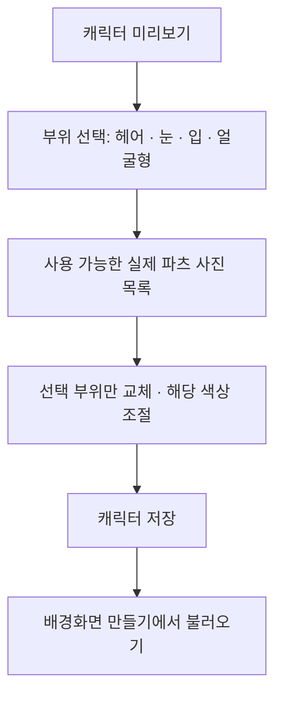

# 캐릭터 파츠 선택 설계 — 헤어부터 적용

작성: 2026-10-10 · 상태: 사용자 문서 검토 대기 · 제품 코드 미변경

## 1. 확정한 사용자 의도

사진 목록에서 고른 부위만 바꾸고, 나머지 캐릭터 외형은 유지한다. 헤어뿐 아니라 앞으로 추가할 눈·입·얼굴형도 같은 선택 방식을 사용한다. 최종 결과는 캐릭터로 저장하고 이미지와 조합한 배경화면에서 다시 사용할 수 있어야 한다.

- 헤어 변경: 얼굴·몸·의상·눈 모양·눈 색상을 유지한다.
- 눈 변경: 헤어·입·얼굴형·몸·의상을 유지한다.
- 입 변경: 눈·헤어·얼굴형·몸·의상을 유지한다.
- 얼굴형 변경: 선택한 눈·입·헤어와 몸·의상을 유지한다. 결합이 불가능한 파츠 조합은 선택 전에 차단하고 이유를 표시한다.
- 모양 선택과 색상 선택은 별개다. 모양을 바꿔도 사용자가 지정한 색상은 유지한다. 원본 색상 모드는 선택한 파츠의 원래 색을 사용한다.

## 2. 범위와 현재 자료

이번 구현 대상은 실제 자료가 있는 E 기본 헤어와 Hair02 두 종류다. 앞머리와 뒤머리를 포함한 전체 헤어스타일을 하나의 선택 항목으로 취급한다. 앞머리/뒤머리의 자유로운 혼합은 이번 범위가 아니다.

눈·입·얼굴형은 동일한 사용자 경험 및 데이터 분리 원칙을 이 문서에 확정한다. 교체용 자료가 없는 지금, 가짜 선택 항목이나 동작하지 않는 모양 변경 버튼을 만들지 않는다. 준비되지 않은 부위는 현재 기본 외형을 유지하며 준비 상태를 설명한다. 기존 눈 색상 편집은 계속 사용할 수 있다.

현재 검증 가능한 자료는 E 기본, Hair02 및 기존 E+Hair02 조합 결과다. 이 중 독립 헤어 파츠 파일은 아직 없다. E 기본의 뒤머리 일부는 Body 메시 안에 있으므로 이름이 Body라는 이유로 메시 전체를 제거해서는 안 된다. Y/test 등 다른 캐릭터를 E의 교체 파츠로 간주하지 않는다.

첨부된 게임 화면은 선택 UI 참고 자료다. 사진 속 헤어의 3D 자료가 제공된 것으로 해석하지 않는다. 게임 자료 추출, 새 모델 생성 유료 API 및 외부 업로드는 하지 않는다.

## 3. 화면

- 미리보기는 부위 선택 시 머리/얼굴을 확인하기 쉬운 구도로 표시하며 기존 전신 보기 기능을 유지한다.
- 목록 사진은 실제 등록된 파츠를 같은 기준 캐릭터·카메라·조명으로 렌더링한 결과다. 게임 사진이나 임의 그림으로 대체하지 않는다.
- 선택 항목은 금색 테두리와 선택 표시를 함께 사용한다. 접근성 이름에는 파츠 이름과 선택 상태를 포함한다.
- 헤어 화면 안에서 목록과 헤어 색상 팔레트/RGB/HEX를 함께 사용할 수 있다. 휴대전화는 세로로 배치하고 넓은 화면은 나란히 배치한다.
- 눈 모양 선택과 기존 홍채 색상 편집은 구분한다. 준비되지 않은 모양 목록 때문에 이미 작동하는 색상 기능을 막지 않는다.
- 부위마다 기본 파츠로 되돌리는 항목을 제공한다. 부위 되돌리기는 다른 부위나 색상 설정을 초기화하지 않는다.
- 준비된 자료만 목록에 표시한다. 자료가 두 개일 때 추천/전체 목록을 중복해서 만들거나 불필요한 검색 기능을 추가하지 않는다.

## 4. 구현 방식과 재사용

채택 방식은 **기준 캐릭터 + 독립 헤어 파츠 → 검증된 조합 결과 → 기존 VRM 렌더러**다. 교체할 때 결과 모델을 다시 읽을 수 있으며, 얼굴/몸 객체의 메모리 주소까지 유지하는 무로딩 교환을 약속하지 않는다. 사용자에게 보이는 유지 조건은 외형·선택·색상·저장 데이터의 동일성이다.

기존 Node 조립 도구의 파츠 소유권 판정, 공통 뼈 연결, 보호 부위 지문 검사 규칙을 재사용한다. Node의 파일 API를 Android WebView에서 그대로 실행할 수 있다고 가정하지 않는다. 기기 내 추출/조합은 Android의 파일·JSON 기능과 백그라운드 작업으로 처리하고, 기존 Node 결과를 비교 기준으로 사용한다. 렌더러에는 검증 완료된 단일 모델만 전달한다. 새 3D 엔진이나 범용 플러그인 체계는 추가하지 않는다.

대안인 실행 중 메시·스켈레톤 즉시 교환은 이번에 채택하지 않는다. 기존 얼굴/몸의 GPU 객체를 유지할 수 있지만 흔들림 연결과 자원 소유권 처리가 더 복잡하다. 현재 사용자 요구는 부위별 외형 유지이며 무로딩 전환은 필수가 아니다.

### 실제 독립 헤어 파츠의 내용

- 헤어에 속하는 정점·면·재질·원본 텍스처, 스키닝 데이터와 헤어 전용 뼈.
- 기준 머리/목 등에 연결할 지점, 헤어 흔들림 설정과 필요한 충돌체 참조.
- 파츠 ID, 형식 버전, 호환되는 기준 모델 지문, 내용 해시 및 헤어 색상 적용 대상.
- 얼굴·몸·의상·귀·꼬리의 형상과 해당 외형 데이터는 파츠에 포함하지 않는다. 기준 뼈와 충돌체는 필요한 연결 정보로 참조한다.
- 원본 이미지 바이트와 텍스처 해상도를 유지한다. 파츠 사진만 별도로 작은 크기로 만든다.

### 등록과 로딩 흐름

1. 기존 앱에 가져온 알려진 E 자료를 확인한다. E 기본과 원본 Hair02 또는 검증된 기존 E+Hair02 조합에서 필요한 헤어만 추출한다.
2. 필요한 원본이 없다면 기존 파일 선택 흐름으로 사용자에게 해당 자료를 가져오도록 안내한다. 기존 파일을 검색 없이 임의 경로에서 읽지 않는다.
3. 파츠 내용·연결·기준 외형 보호 검사를 통과한 경우에만 앱 내부에 등록하고 목록에 표시한다.
4. 헤어 선택 시 기준 E에서 기존 헤어 부분만 제외하고 독립 파츠를 조립한다. 전체 donor 캐릭터로 바꾸는 방식으로 대신하지 않는다.
5. 임시 결과를 검증한 뒤 원자적으로 게시한다. 기준 모델 해시·파츠 내용 해시·조립 버전으로 캐시를 식별한다. 색상과 카메라 설정은 모델 캐시와 분리한다.
6. 렌더러의 초기 외형 설정에 선택한 파츠와 색상을 함께 전달한다. 준비 완료 후에만 선택을 확정하고 사진/편집 상태를 갱신한다.

## 5. 모든 파츠에 공통으로 지킬 저장 계약

캐릭터 ID와 이름, 저장 revision은 기존 저장 체계를 유지한다. 외형은 기준 모델, 부위별 선택 ID, 부위별 색상을 구분하여 저장한다. 헤어 변경으로 캐릭터 ID를 새로 만들거나 다른 부위의 선택을 덮어쓰지 않는다.

- 새 외형 형식은 `profileVersion: 2`를 사용한다. `parts`에는 현재 지원하는 `hair` 선택 ID만 기록하고, 추후 검증된 자료가 추가될 때 `eyes`, `mouth`, `face`를 같은 구조로 추가한다. 없는 부위는 기준 외형이다.
- 파츠 ID는 내용 해시와 연결된 변경 불가능한 등록 항목을 가리킨다. 같은 ID의 내용을 바꿔 기존 배경화면의 외형이 바뀌게 만들지 않는다.
- 기존 외형 JSON의 색상은 `hair`·`iris` 키를 그대로 사용한다. 두 키는 필수이며 원본 색상은 `null`, 지정 색상은 대문자 `#RRGGBB`다. 파츠 ID와 색상 키를 혼용하지 않는다.
- 조합 결과의 `modelId`는 렌더링할 파일의 실제 해시다. 사용자 의도의 기준은 기준 모델과 파츠 선택이며, 임의 파일의 해시만 등록했다고 파츠 호환성을 인정하지 않는다.
- 기존 `profileVersion: 1` 캐릭터, 임시 저장, 이미지 합성 장면, 배경화면은 계속 읽는다. 구형 전체 조합 파일도 삭제하거나 강제로 재작성하지 않는다.
- 구형 캐릭터를 새 방식으로 편집할 때 필요한 파츠 자료가 없으면 기존 미리보기와 데이터는 유지하고 자료 준비를 안내한다. 기본 머리로 몰래 대체하지 않는다.
- 변환은 사용자의 저장 동작에서만 새 외형으로 게시한다. 실패 시 이전 저장본은 그대로 유지한다.
- 이미지 합성 장면/배경화면에는 적용 당시 외형의 불변 복사본을 저장한다. 원본 캐릭터의 이후 헤어 변경이 이미 저장한 배경화면을 바꾸지 않는다.
- 장면의 `modelId`와 내장된 캐릭터 외형의 `modelId`는 같아야 하며 저장된 캐릭터 revision은 양수여야 한다. 다른 모델로 교체할 때는 같은 모델의 위치만 갱신하는 호출을 재사용하지 않고 뷰를 다시 준비한다.
- 저장 캐릭터·초안·장면·적용 중 배경화면이 참조하는 원본/파츠/조합 결과는 캐시 정리 대상에서 제외한다. 기존 저장소의 사용 중 파일 보호 규칙을 우회하지 않는다.
- v1.22의 저장 중 편집 잠금, 임시 저장 정리, 화면 회전/복귀 시 revision 재확인 규칙을 유지한다.

눈·입·얼굴형의 사용자 인터페이스는 같지만 내부 처리는 반드시 동일한 메시 교환일 필요가 없다. 검증된 모양 변형 데이터 또는 교체 메시 등 부위에 맞는 자료를 사용한다. 표정용 눈감기/입벌리기를 새 눈/입 모양이라고 표시하지 않는다. 얼굴형과 눈·입·헤어의 조합 검증을 통과하지 못한 자료는 활성화하지 않는다.

## 6. 안정성·품질·보안

- 선택 순서를 식별하여 가장 최근 요청만 적용한다. 연속 선택, 화면 회전, 뒤로 가기 중 완료된 오래된 작업은 화면과 저장 상태를 덮어쓰지 않는다.
- 추출/조합은 UI 스레드 밖에서 직렬 처리하고 대형 작업을 중복 실행하지 않는다. 원본 텍스처는 GPU로 디코딩하지 않고 파일 바이트로 복사한다.
- 기존 메모리 정책에 조립 입력/출력 버퍼 사용량도 포함한다. 메모리가 부족하면 품질을 몰래 낮추지 않고 작업을 거절하거나 재시도를 안내한다.
- 두 완성 캐릭터를 동시에 GPU에 올려 전환하지 않는다. 로딩 중 표시를 사용하고 새 로딩 실패 시 마지막 정상 모델로 복귀한다. 렌더링 자체를 복구하지 못해도 저장 데이터는 유지한다.
- 뼈·정점·텍스처 참조 범위, 파일 크기, 파츠 형식 버전, 기준 모델과 보호 부위 지문, 외부 리소스 참조를 검사한다. 미지원 파일은 등록하지 않는다.
- 공유 WebView의 로컬 리소스 허용 목록과 네트워크 차단을 유지한다. 파츠 처리를 위해 임의 파일 접근이나 외부 URL 로딩을 열지 않는다.
- 헤어 분리 과정에서 얼굴 표정, 눈동자 추적, 피부/의상/귀/꼬리, 보호된 흔들림 설정을 변경하지 않는다.
- 기존 홍채 보호 마스크는 검증된 E 텍스처에만 적용한다. 재조합으로 모델 해시가 바뀌더라도 정확한 기준 모델/파츠/재질 검증으로 색상 프로필을 연결한다. 임의 모델 허용으로 바꾸지 않는다.
- 사용자 모델·파츠·텍스처·개인 미리보기는 Git/APK/공개 Release에 포함하지 않는다. 파일은 사용자 기기의 앱 내부에 보관한다.

## 7. 변경이 이어져야 하는 위치

경로 기준은 `MagicCircleAndroid/`다. 실제 구현 시 필요한 최소 변경만 한다.

| 영역 | 기존 위치 / 이어야 하는 계약 |
|---|---|
| 헤어 판정·검증 기준 | `vrm-viewer/tools/inspect-hair-source.mjs`, `compare-hair-source.mjs`, `assemble-hair.mjs` 및 테스트 |
| 외형·저장 | `app/src/main/java/com/yj/magiccircle/VrmAvatarDefinition.kt`, `VrmAvatarStore.kt`, `VrmModelStore.kt` |
| 사진형 선택 화면 | `app/src/main/java/com/yj/magiccircle/VrmAvatarActivity.kt` |
| 색상 및 미리보기 | `vrm-viewer/avatar-dye.js`, `viewer.js`, 메모리 정책, `VrmWebView.kt` |
| 이미지 합성·배경화면 | `ScreenScene.kt`, `VrmSceneView.kt`, `VrmSceneDialog.kt`, `VrmWallpaperStore.kt`, `MediaLibrary.java`, `UploadedWallpaperStore.kt`와 실제 소비자 |
| 회귀 검증 | 기존 Node 테스트, Android 외형/저장 단위 테스트, `VrmAvatarEditorChecks`, `VrmAvatarStorageChecks`, `VrmAvatarSaveChecks`, `VrmAvatarSceneChecks` |

## 8. 합격 조건과 공개 결과

1. E 기본 ↔ Hair02를 선택하면 실제 헤어만 달라지고, 얼굴·몸·의상·귀·꼬리·표정의 보호 지문이 유지된다.
2. 원본 색상/사용자 지정 머리색/독립 눈 색상이 교체·저장·재실행 후 의도대로 유지된다. 다른 부위를 일괄 염색하지 않는다.
3. 정면·측면·뒤쪽과 고개 움직임에서 뒤머리 누락, 떠 있는 머리, 두피 노출, 늘어진 정점, 흔들림 연결 이상이 없는지 실제 렌더링으로 확인한다. 지문 통과만으로 외형 합격을 선언하지 않는다.
4. 목록 사진과 선택 결과가 일치하고, 휴대전화/태블릿 화면에서 선택 표시·색상 조절·오류 안내를 사용할 수 있다.
5. 연속 선택, 선택 중 종료/회전/복귀, 실패 복구, 저장 중 입력 및 기존 v1.22 데이터 읽기를 검증한다.
6. 이미지 합성 장면 저장/재열기와 배경화면의 외형 복사본이 동일하다. 기존 저장 장면과 배경화면을 임의로 바꾸지 않는다.
7. 필요한 Node 테스트, `testDebugUnitTest`, `lintDebug`, `assembleDebug`를 통과한 후 명시한 가상 기기에서 확인한다. Samsung 실기기 검증 여부는 따로 보고한다.
8. 기능 구현 단계에서 버전을 증가시키고 GitHub Actions APK 빌드 및 공개 다운로드의 버전·해시·업데이트 서명을 검증한다. 이번 문서 작성 단계에서는 버전이나 APK를 변경하지 않는다.

## 9. 지금 하지 않는 일

교체용 눈·입·얼굴형 3D 자료를 자동 생성했다고 주장하지 않는다. 의상·체형 편집, 앞/뒤머리 혼합, 임의 VRM 간 파츠 호환, 무로딩 런타임 교환, VRM 내보내기는 이번 헤어 구현 범위 밖이다. 사용자가 나중에 제공한 자료는 부위별 검증을 거쳐 같은 사진 목록 흐름에 추가한다.

이 문서의 사용자 검토를 받은 뒤 구현 계획을 작성한다. 계획 검토와 실행 방식 선택 전에는 제품 코드를 변경하지 않는다.
